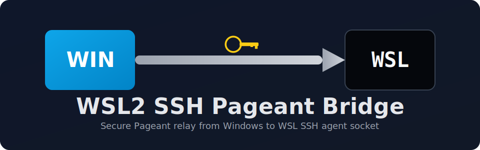

<p align="center">
	
</p>

# 🛡️ WSL2 SSH Pageant Bridge

**A robust bridge to use Windows Pageant (smart card/certificate) keys from WSL 2.**

[](https://opensource.org/licenses/MIT)
[](https://docs.microsoft.com/en-us/windows/wsl/)

`WSL2 SSH Pageant Bridge` forwards Pageant identities into WSL through a Unix socket, so SSH/Git in Linux can use hardware-backed keys managed on Windows.

---

## 🎯 Why this exists

WSL cannot directly consume Windows Pageant identities. This project creates a bridge:

`SSH client (WSL)` ↔ `SSH_AUTH_SOCK` ↔ `socat` ↔ `npiperelay.exe` ↔ `Windows named pipe` ↔ `Pageant`

Component roles:

- `SSH client (WSL)`: tools such as `ssh`, `git`, or `ssh-add` that expect to talk to an SSH agent from inside Linux.
- `SSH_AUTH_SOCK`: the Unix socket path exported in your shell so Linux tools know where the SSH agent is reachable.
- `socat`: the local relay process that listens on the Unix socket and forwards requests to the Windows side.
- `npiperelay.exe`: the bridge binary that converts Linux-side traffic into Windows named pipe traffic.
- `Windows named pipe`: the Windows IPC channel used by Pageant to expose its agent interface.
- `Pageant`: the Windows SSH agent holding your smart card/CAPI-backed identities and answering authentication requests without exporting private keys into WSL.

---

## ✅ What the current version handles

- Automatic install of dependencies (`socat`, `curl`, `unzip`) when missing.
- Multi-distro package manager support in installer (`apt`, `dnf`, `pacman`, `zypper`).
- Systemd user service configured for WSL interop (`powershell.exe` reachable from service environment).
- Reliable service behavior with `Type=oneshot` + `RemainAfterExit=yes` (no restart loop).
- Shell config update in **both** `~/.bashrc` and `~/.zshrc` when present.
- Uninstall cleanup in **both** `~/.bashrc` and `~/.zshrc`.
- Fallback when `npiperelay.exe` is not executable/owned by root (user-local executable copy).

---

## 📋 Prerequisites

### Windows
- [Pageant](https://www.chiark.greenend.org.uk/~sgtatham/putty/latest.html) running.
- Your certificate loaded in Pageant (`Add CAPI cert`).

### WSL
- WSL interop enabled (default in most setups).
- user systemd enabled.
- Internet access if installer needs to download `npiperelay`.

### If WSL interop is disabled

This project needs Windows executables to be callable from WSL, especially `powershell.exe`.

Quick check:

```bash
command -v powershell.exe
```

If this returns nothing, check `/etc/wsl.conf` and make sure interop is enabled:

```ini
[interop]
enabled=true
appendWindowsPath=true
```

Then restart WSL from Windows:

```powershell
wsl --shutdown
```

Open WSL again and verify:

```bash
command -v powershell.exe
```

---

## 🚀 Installation (recommended)

`install.sh` automatically downloads `npiperelay.exe` from GitHub (release asset), then installs it into `~/.local/bin`.

Primary download URL used by the installer:

`https://github.com/jstarks/npiperelay/releases/download/v0.1.0/npiperelay_windows_amd64.zip`

```bash
git clone https://github.com/MohandHAMADOUCHE/wsl2-ssh-pageant-bridge.git
cd wsl2-ssh-pageant-bridge
chmod +x install.sh
./install.sh
```

After install, open a new terminal or run `source ~/.bashrc` / `source ~/.zshrc`.

---

## ▶️ Verify installation

1. Check service status:

```bash
systemctl --user status wsl2-ssh-pageant-bridge.service --no-pager
```

2. Check socket + key visibility:

```bash
echo "$SSH_AUTH_SOCK"
ls -l "$SSH_AUTH_SOCK"
ssh-add -l
```

3. If Pageant is not active:
- Start **Pageant** on Windows.
- In Pageant, load your certificate/key (`Add CAPI cert`).

4. Restart and verify again:

```bash
systemctl --user restart wsl2-ssh-pageant-bridge.service
ssh-add -l
```

---

## 🧪 Quick health check

Run this from WSL to validate the full chain (service + socket + key visibility):

```bash
systemctl --user is-active wsl2-ssh-pageant-bridge.service
echo "$SSH_AUTH_SOCK"
ls -l "$SSH_AUTH_SOCK"
ssh-add -l
```

Expected result:
- service is `active`
- socket exists
- at least one key is listed by `ssh-add -l`


---

## ⚙️ Manual installation (advanced)

```bash
mkdir -p ~/.local/bin ~/.config/systemd/user
cp wsl2-ssh-pageant-bridge.sh ~/.local/bin/wsl2-ssh-pageant-bridge.sh
cp wsl2-ssh-pageant-bridge.service ~/.config/systemd/user/wsl2-ssh-pageant-bridge.service
chmod +x ~/.local/bin/wsl2-ssh-pageant-bridge.sh
```

Ensure `npiperelay.exe` exists at `~/.local/bin/npiperelay.exe` (or in your `PATH`), then:

```bash
systemctl --user daemon-reload
systemctl --user enable --now wsl2-ssh-pageant-bridge.service
```

And set:

```bash
export SSH_AUTH_SOCK="$HOME/.ssh/wsl-ssh-agent.sock"
```

---

## 🐚 Shell behavior

The installer appends this line to both shell rc files (if they exist):

```bash
export SSH_AUTH_SOCK="$HOME/.ssh/wsl-ssh-agent.sock"
```

This is intentionally appended at the end, so it overrides earlier `gpg-agent`/`ssh-agent` socket exports.

---

## ⚠️ Known limitations

- Pageant must be running on Windows.
- WSL interop must be enabled (`powershell.exe` available from WSL).
- User systemd must be enabled in WSL.
- If Pageant has no loaded cert/key, the bridge is reachable but `ssh-add -l` can return an empty-agent state.

---

## 🛠️ Troubleshooting

### 1) Check service and logs

```bash
systemctl --user status wsl2-ssh-pageant-bridge.service --no-pager
journalctl --user -u wsl2-ssh-pageant-bridge.service -n 20 --no-pager
```

### 2) Check socket + key visibility

```bash
echo "$SSH_AUTH_SOCK"
ls -l "$SSH_AUTH_SOCK"
ssh-add -l
```

### 3) Common cases

| Symptom | Meaning | Fix |
| :--- | :--- | :--- |
| `❌ Error: Pageant (Windows) was not detected.` | Pageant pipe not visible from WSL/service context. | Start Pageant on Windows; verify service PATH and WSL interop. |
| `The agent has no identities.` | Bridge is up, but no key loaded in Pageant. | In Windows Pageant: `Add CAPI cert`, then right-click Pageant and enable `Autoreload Certs & Keys` |
| `Permission denied` for `npiperelay.exe` | Non-executable binary (often root-owned). | Re-run installer or `chmod +x ~/.local/bin/npiperelay.exe`; script also has a user-cache fallback. |
| `Error connecting to agent: No such file or directory` | `SSH_AUTH_SOCK` points to a missing socket, or bridge socket was not recreated. | Check `SSH_AUTH_SOCK`, verify Pageant pipe with the PowerShell command below, then `systemctl --user restart wsl2-ssh-pageant-bridge.service` and retry `ssh-add -l`. |
| `ssh-add -l` → `error fetching identities: communication with agent failed` | Pageant is not running (or bridge lost communication). | Start Pageant on Windows, load your cert/key, then run `systemctl --user restart wsl2-ssh-pageant-bridge.service` and retry `ssh-add -l`. |

If this command returns a Pageant pipe name:

```bash
powershell.exe -Command "(Get-ChildItem \\\\.\\pipe\\ | Where-Object { \$_.Name -like '*pageant*' } | Select-Object -First 1).Name" 2>/dev/null | tr -d '\r'
```

restart the bridge service and retry:

```bash
systemctl --user restart wsl2-ssh-pageant-bridge.service
ssh-add -l
```

If interop is disabled, `powershell.exe` will not be available inside WSL and the bridge cannot detect Pageant.

### 4) If the service fails during installation

If installation shows something like:

```text
Mar 11 18:14:22 ... wsl2-ssh-pageant-bridge.service: Failed with result 'exit-code'.
Mar 11 18:14:22 ... Failed to start wsl2-ssh-pageant-bridge.service - WSL2 SSH Pageant Bridge.
```

do the following:

1. Start **Pageant** on Windows.
2. Make sure your certificate is loaded in Pageant.
3. Restart the user service from WSL:

```bash
systemctl --user start wsl2-ssh-pageant-bridge.service
```

4. Verify the service status:

```bash
systemctl --user status wsl2-ssh-pageant-bridge.service --no-pager
```

5. Verify key visibility:

```bash
ssh-add -l
```

---

## ❓ FAQ

### Do private keys get copied into WSL?
No. Private keys stay on Windows in Pageant (smart card/CAPI side). WSL only communicates with the agent through a socket.

### Why do I see `Warning: Agent is empty.`?
The bridge is running, but Pageant has no loaded identity. In Windows Pageant, use `Add CAPI cert`, then run:

```bash
systemctl --user restart wsl2-ssh-pageant-bridge.service
ssh-add -l
```

### Why does `ssh-add -l` change after `source ~/.bashrc`?
Another tool (often `gpg-agent`) may override `SSH_AUTH_SOCK`. Keep this export at the end of your rc file:

```bash
export SSH_AUTH_SOCK="$HOME/.ssh/wsl-ssh-agent.sock"
```

---

## 🧹 Uninstall

```bash
chmod +x uninstall.sh
./uninstall.sh
```

- Stops/disables the user systemd service.
- Removes service/script/binary files installed by this project.
- Removes bridge export line from both `~/.bashrc` and `~/.zshrc`.
- Open a new shell (or `source` your rc file) to return to your local SSH/GPG agent setup.

